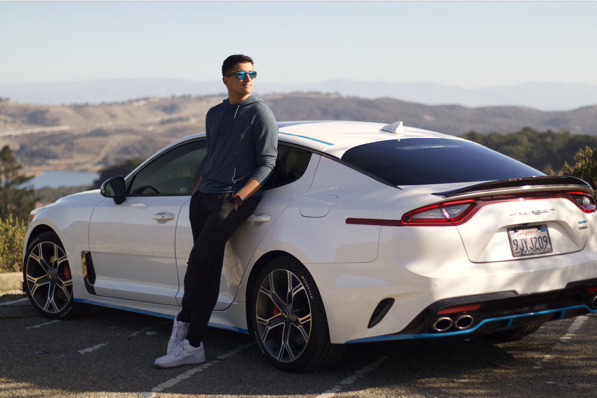

# **Aryan's User Page**

## Introduction
Hi! My name is **Aryan Desai** and I am currently a **junior** at [UC San Diego](https://ucsd.edu). I am majoring in **Computer Engineering** through the [ECE Department](https://www.ece.ucsd.edu)!
## Sections
- [**Aryan's User Page**](#aryans-user-page)
  - [Introduction](#introduction)
  - [Sections](#sections)
  - [CSE Coursework Thus Far](#cse-coursework-thus-far)
  - [Programming Languages I've Used](#programming-languages-ive-used)
  - [Hobbies](#hobbies)
    - [Photography](#photography)
    - [Formula One](#formula-one)
  - [Remaining Markdown Constructs](#remaining-markdown-constructs)
## CSE Coursework Thus Far
So far, these are the courses from the [CSE Department](https://cse.ucsd.edu) that I have completed!
- [x] CSE 11: Introduction to Programming and Computational Problem Solving
- [x] CSE 12: Basic Data Structures and Object-Oriented Design
- [x] CSE 15L: Software Tools and Techniques Laboratory
- [x] CSE 30: Computer Organization and Systems Programming
- [x] CSE 100: Advanced Data Structures
- [x] CSE 101: Design and Analysis of Algortihms
- [x] CSE 142: Introduction to Computer Architecture: A Software Perspective
- [x] CSE 142L: Software Project for Computer Architecture
- [x] CSE 151A: Introduction to Machine Learning
- [x] CSE 158: Recommender Systems and Web Mining 
- [ ] CSE 110: Software Engineering _(in progress)_
- [ ] CSE 140: Components and Design Techniques for Digital Systems _(in progress)_
- [ ] CSE 140L: Digital Systems Laboratory _(in progress)_
## Programming Languages I've Used
- Java
- JavaScript
- HTML
- Python
- MATLAB
- C
- C++
- Assembly (x86 and ARM)
- C#
- TypeScript
> This is what my favorite Python Code Looks Like!
```
print("Hello, World!")
```
## Hobbies
In my free time, I enjoy being a photohgrapher specifically focusing on automotive content and portraits! I'm also a huge fan of Formula One! 
### Photography
Below, you can check out some of my favorite pictures that I've taken over the years!
- [Kia Stinger](UserPagePictures/StingerFrontPic.jpg)
- [Lamborghini Aventador SVJ](UserPagePictures/SVJRollerPic.jpg)
- [Mercedes-AMG GT3](UserPagePictures/GT3RaceDayPic.jpg)
### Formula One
I love watching Formula One and have never missed watching a race in over 5 years! I ranked my top 5 favorite current Formula One Drivers below!
1) Carlos Sainz
2) Lando Norris
3) Lewis Hamilton
4) Oscar Piastri
5) Alex Albon
## Remaining Markdown Constructs
Some of the additional styling text options were not used in the page. In order to show them off, I've included examples of them below! 

This is what ~~striking text through~~ looks like. 

This is what **bold and _nested italics_ text** looks like.

This is what ***all bold and italics text*** looks like.

This is what a <sub>subscript</sub> looks like.

This is what a <sup>superscript</sup> looks like.

And those are all the other Markdown Styling Text outcomes! 


